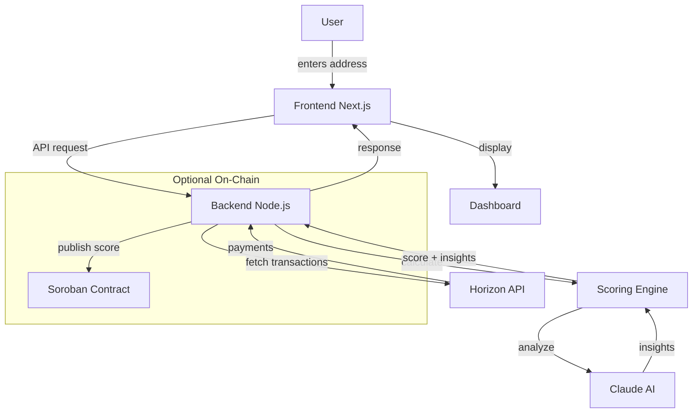

# FluxID

**Liquidity Identity Layer on Stellar — Turn any wallet into a real-time financial identity.**

[](https://stellar.org)
[](https://anthropic.com/)

---

## Overview

FluxID is a liquidity intelligence layer built on **Stellar** that turns any wallet into a real-time financial identity.

Instead of just showing balances, FluxID analyzes **how money behaves**, inflow patterns, outflow stability, transaction frequency, and flow consistency and produces a simple, explainable trust score.

> **The Problem:** Traditional finance and crypto both track what you have, but not how you behave financially. Trust becomes guesswork.
> 
> **FluxID's Solution:** A dynamic Liquidity Identity, that analyze any Stellar wallet address without permission, get a 0-100 trust score with risk level, and understand why through AI-generated insights.

---

## Architecture



### Data Flow

1. **User** enters Stellar wallet address in frontend
2. **Frontend** sends request to backend API
3. **Backend** fetches transactions via Stellar Horizon
4. **Scoring Engine** calculates liquidity score (0-100) and risk level
5. **Claude AI** analyzes patterns and generates behavior insights
6. **Frontend** displays score, risk, and AI insights
7. **Optional**: Score stored on Soroban for on-chain verification

---

## Stellar Integration

FluxID is built natively on **Stellar** for all blockchain operations.

### Horizon API — Transaction Fetching

| Function | What It Does |
|----------|-------------|
| [`getPayments()`](https://github.com/StellarVhibes/FluxID/blob/main/backend/src/services/horizon.service.ts#L36) | Fetches wallet payments via Horizon API |
| [`getAccountTransactions()`](https://github.com/StellarVhibes/FluxID/blob/main/backend/src/services/horizon.service.ts#L85) | Full transaction history |
| [Swap filtering](https://github.com/StellarVhibes/FluxID/blob/main/backend/src/services/horizon.service.ts#L62) | Excludes self-swaps from inflow/outflow |

### Freighter Wallet — Connection

| Function | What It Does |
|----------|-------------|
| [`useFreighter()`](https://github.com/StellarVhibes/FluxID/blob/main/frontend/app/context/FreighterContext.tsx#L189) | Wallet connection hook |
| [`connect()`](https://github.com/StellarVhibes/FluxID/blob/main/frontend/app/context/FreighterContext.tsx#L27) | Connect to Freighter |
| [Sign payment](https://github.com/StellarVhibes/FluxID/blob/main/frontend/lib/agentDemo.ts#L10) | Agent payment signing |

### Soroban — On-Chain Storage (Optional)

| Contract | What It Does |
|----------|-------------|
| [Score storage](https://github.com/StellarVhibes/FluxID/blob/main/backend/src/routes/contract.routes.ts#L35) | Store scores on-chain |
| [Get score](https://github.com/StellarVhibes/FluxID/blob/main/backend/src/routes/contract.routes.ts#L71) | Read from contract |

---

## AI Integration

FluxID uses **Anthropic Claude** for explainable behavior insights.

### Claude AI — Behavior Analysis

| Function | What It Does |
|----------|-------------|
| [`explainBehavior()`](https://github.com/StellarVhibes/FluxID/blob/main/backend/src/services/explainability/llm.ts#L10) | Claude Haiku integration |
| [`getExplanation()`](https://github.com/StellarVhibes/FluxID/blob/main/backend/src/services/explainability/index.ts#L8) | Entry point for AI |
| [Score + AI](https://github.com/StellarVhibes/FluxID/blob/main/backend/src/routes/score.routes.ts#L66) | Combined score + AI response |

**What Claude Analyzes:**
- Inflow/outflow consistency
- Transaction patterns over time
- Volume trends
- Risk factors
- Asset diversity

**Response:**
```json
{
  "insight": "This wallet shows consistent incoming payments...",
  "suggestions": ["Increase transaction frequency", "Diversify counterparties"]
}
```

---

## Agentic AI — X402 Payments

FluxID enables AI agents to **pay for intelligence** using Stellar.

### Payment Flow

| Step | What Happens |
|------|------------|
| 1. Request | Agent requests `/paid/score/{wallet}` |
| 2. 402 Response | [`HTTP 402 Payment Required`](https://github.com/StellarVhibes/FluxID/blob/main/backend/src/routes/paid.routes.ts#L184) |
| 3. Payment | Agent pays XLM via Freighter |
| 4. Verify | [On-chain verification](https://github.com/StellarVhibes/FluxID/blob/main/backend/src/services/payment.service.ts#L92) |
| 5. Score | Return score after payment |

### Agent Demo

Live demo showing AI agent:
- [Requesting score](https://github.com/StellarVhibes/FluxID/blob/main/frontend/lib/agentDemo.ts#L69)
- [Signing payment](https://github.com/StellarVhibes/FluxID/blob/main/frontend/lib/agentDemo.ts#L58)
- [Polling for result](https://github.com/StellarVhibes/FluxID/blob/main/frontend/lib/agentDemo.ts#L145)

---

## Core Features

| Feature | Description |
|---------|------------|
| Address-based analysis | Analyze any wallet without permission |
| Liquidity Score | 0-100 trust score |
| Risk Level | Low / Medium / High |
| Flow breakdown | Inflows, outflows, swaps tracked separately |
| Behavior insights | AI-generated explanation |
| Suggestions | Actionable recommendations |

---

## Use Cases

FluxID is infrastructure for:

- **Lending Platforms** — Score = 82 → Approve loan, Score = 34 → Reduce
- **Freelance Platforms** — Consistent inflow → Reliable user verification
- **Remittance Apps** — Detect behavior patterns for better allocation
- **Marketplaces** — Enable flexible payments for trusted users

---

## Tech Stack

| Layer | Technology |
|-------|-----------|
| Blockchain | Stellar (Horizon + Soroban) |
| Backend | Node.js + Fastify |
| Frontend | Next.js + TypeScript |
| AI | Anthropic Claude (Haiku) |
| Wallet | Freighter |
| Styling | Tailwind CSS |

---

## Getting Started

```bash
# Frontend
cd frontend && npm install && npm run dev

# Backend  
cd backend && npm install && npm run dev
```

---

## Project Structure

```
FluxID/
├── frontend/           # Next.js PWA
├── backend/           # Node.js scoring
├── smartcontract/    # Soroban contracts
└── docs/             # Documentation
```

---

## Key Links

- [Frontend](https://github.com/StellarVhibes/FluxID/tree/main/frontend)
- [Backend](https://github.com/StellarVhibes/FluxID/tree/main/backend)
- [Smart Contracts](https://github.com/StellarVhibes/FluxID/tree/main/smartcontract)

---

## Project Strategy & Phases

FluxID is being executed in three distinct phases. We keep our word and deliver in stages.

- ✅ **Phase 1: MVP (Single Wallet Scoring) — COMPLETED**
  We have successfully built the core scoring engine, live dashboard, and AI explainability. The foundation is set.

- 🏗️ **Phase 2: Scale (Protocol Intelligence) — IN PROGRESS**

  - **User-base health metrics**: Aggregate scoring and health monitoring for whole ecosystems.
  - **Risk heatmaps & alerts**: Visual risk clustering and early warning system for large-scale drops in trust.
  - **API-first infrastructure**: Programmable trust signals for developers and platforms.
  - **X402 agentic payments**: Enabling AI agents to pay for intelligence on-chain.

  and  **Scalable Protocol Sync Engine (Advanced)** that introduces a background synchronization system that enables full user-base analysis.


- 🔮 **Phase 3: Outcome (Internet of Value) — UPCOMING (FINAL PHASE)**
  Our ultimate vision is to establish decentralized reputation and cross-chain trust signals as a global credit primitive.

---

## Post-MVP Roadmap (Phase 2 Building)

After Phase 1 (MVP), FluxID evolves from scoring one wallet to understanding entire user bases.

> **Protocol Intelligence Layer** — A system for analyzing groups of wallets using trust scores.

### What's Coming

1. **User-Base Health Dashboard** — Monitor overall user quality (average score, distribution, trends)
2. **Cohort & Segmentation Engine** — Query wallets by behavior (score > threshold, inflow > threshold)
3. **Risk Heatmaps** — Visualize where risk is concentrated
4. **Early Warning System** — Detect sudden changes in risk (e.g., "12% dropped below 50 in 24h")

### Scalable Protocol Sync Engine (Advanced)”
To support real-world protocol integrations, FluxID will introduce a background synchronization system that enables full user-base analysis.

---

## Vision

> **Liquidity Identity**

A real-time, behavior-based trust layer for financial systems.

---

## Live Demo

- 🌐 **Live App:** [https://fluxid.vercel.app/](https://fluxid.vercel.app/)
- 📊 **Pitch Deck:** [View Presentation](https://docs.google.com/presentation/d/1RkhWXOQRWWKaiUFeHB_PFUDzVjQmw2m8/edit?usp=sharing&ouid=111174088021239989424&rtpof=true&sd=true)
- ▶️ **Demo Video:** [View Demo Video](https://www.loom.com/share/ba5e12068bae47b1ac6d504b3f1039d2)

---

*Built on Stellar by @bbkenny , @nonso7 & @xqcxx*
